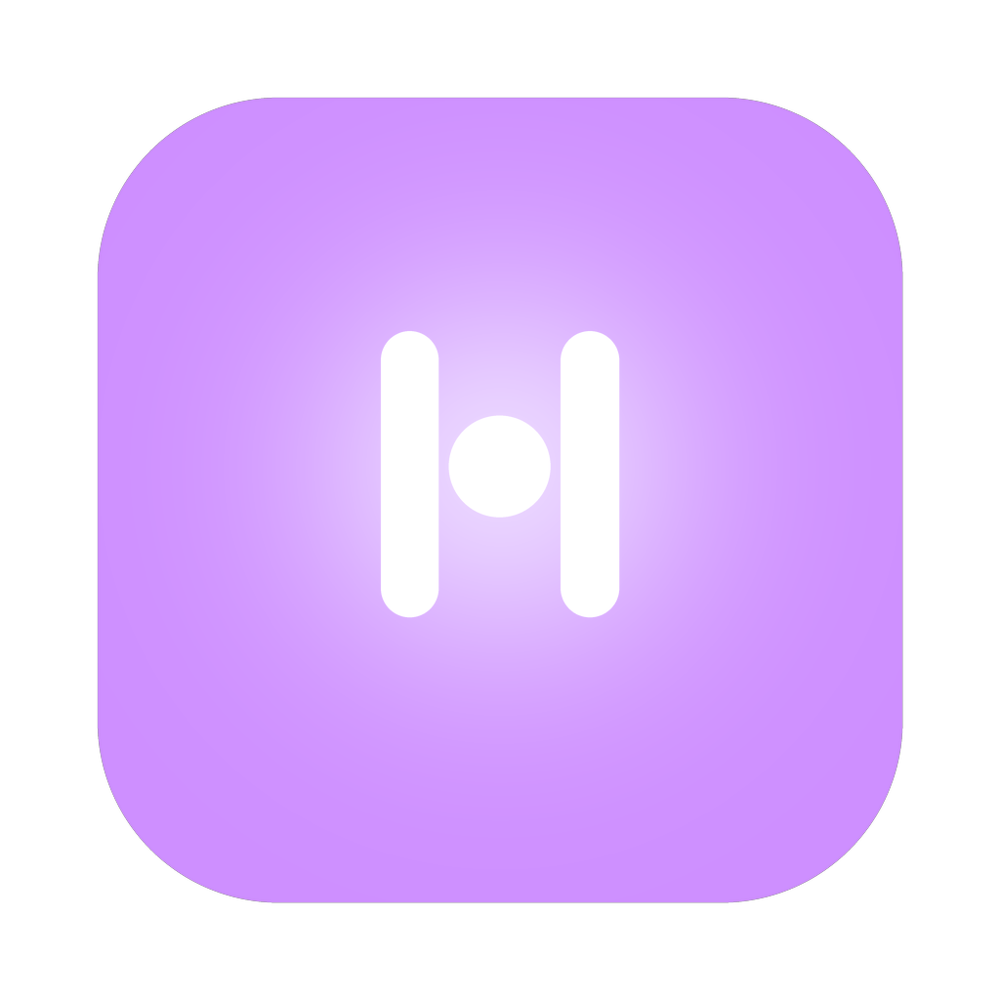

<p align="center">
  
</p>

# Hunch

**Drive your Mac with any LLM: focus-free, in the background, over [MCP](https://modelcontextprotocol.io).**

Hunch is an MCP server that gives an LLM agent hands on *your* Mac: your installed apps, your
logged-in sessions, your files, without taking over your screen. While you keep working in the
foreground, an agent can read a background app's UI, click its buttons, drive Mail or Music by
AppleScript, fill a web form, or move files. It works on real native apps, not just a browser.

> **Works best with modern LLMs.** Hunch ships a detailed playbook as MCP server instructions;
> capable tool-using models (Claude Sonnet/Opus-class and up) follow it well. Smaller models may
> pick clumsier paths (screenshots and keystrokes instead of tree reads and clicks).

## The four layers

Hunch always prefers the most direct layer. It's faster, more reliable, and (except the last)
never touches your screen:

| Layer | Tools | What it's for |
|---|---|---|
| **OS-API** | `trash` `file_op` `open_file` `clipboard_*` `launch_app` … | files, clipboard, app lifecycle, via direct API calls |
| **AppleScript** | `applescript` | scriptable apps: Mail, Messages, Notes, Calendar, Music, Finder, Safari … |
| **Web / CDP** | `web_open` `web_snapshot` `web_act` `web_login` … | any browser page or Electron app, driven in the background |
| **Accessibility** | `snapshot` `act` | any native app's UI: read the tree, click/select/type by reference |

A gated last resort (`screenshot` + coordinate clicks/keystrokes) exists for apps whose
accessibility tree is truly empty. It steals focus, so it asks you first.

## How it works (no server, no cloud)

"MCP server" undersells how local this is. `hunch serve` is a plain Python process that your
MCP host (Claude Desktop, Cursor, …) spawns as a **child process** and talks to over
**JSON-RPC on stdin/stdout** (MCP's stdio transport). There is no HTTP endpoint, no port
Hunch listens on, no daemon, and no telemetry. When your host quits, Hunch is gone.

The tools are direct macOS API calls in-process: the Accessibility framework via pyobjc,
`osascript` for AppleScript, OS APIs for files/clipboard, and, for the web layer, a local
WebSocket to Chrome's DevTools port on `127.0.0.1`. The only thing that ever touches the
network is Chrome itself, doing ordinary browsing. What the model sees is whatever the tools
return through your host; nothing else leaves the machine.

## Install

macOS 13+. Via Homebrew (installs Python and all dependencies in an isolated env):

```
brew install prithviseran/hunch/hunch
```

(PyPI/pipx publication is planned; today Homebrew is the supported path.)

Then, one time:

```
hunch setup      # walk the macOS permission grants + create the browser profile
hunch doctor     # verify every layer; fix anything it flags
hunch connect claude-desktop   # or: claude-code, cursor
```

Restart your MCP host and ask it to *"use hunch to …"*.

### The permissions, honestly

macOS trust attaches to the **app that runs the server**, meaning your MCP host (Claude Desktop,
Cursor, your terminal), not "hunch" itself. `hunch setup` walks you through it:

- **Accessibility** (required): lets Hunch read app UIs and click focus-free. Grant it to your MCP
  host app in System Settings → Privacy & Security → Accessibility.
- **Automation** (per-app, automatic): the first time Hunch scripts an app, macOS shows a one-time
  "allow control" prompt.
- **Screen Recording** (optional): only for the screenshot/vision fallback.

`hunch doctor` reports what's granted. Note: its Accessibility line reflects the *terminal* you ran
it from; the server inherits the *host's* grant.

## Credentials: agents use them, never see them

```
hunch creds add github --domain github.com
hunch creds list
```

Values go straight into the **macOS Keychain**. An agent signs in by calling
`web_fill_login("github")` with only the service *name*; Hunch reads the secret from the Keychain
and types it into the page over CDP. The value never enters the model's context, its logs, or its
provider's servers.

**Domain binding**: a credential added with `--domain github.com` will only ever be typed into
`github.com` (and its subdomains). If a confused or prompt-injected agent lands on a look-alike
page, the fill is refused. Bind every credential; blank (any-site) exists only for compatibility.

No stored credential? Agents fall back to `web_login`, which opens a tagged browser window where
*you* sign in yourself; the session then persists in Hunch's dedicated browser profile.

## Confirmation gates

Your MCP host's tool approvals are the primary permission layer. Hunch adds a content-aware second
gate, a one-click macOS dialog, for the catastrophic cases:

| Gate | Fires on |
|---|---|
| `gates.focus_steal` | actions that take over your keyboard/cursor (`key`, `click_xy`, ref-less typing) |
| `gates.app_to_front` | an app being brought to the front (a focus switch, even mid-fullscreen) |
| `gates.shell` | AppleScript containing `do shell script` |
| `gates.destructive_applescript` | delete / send / empty trash / shut down / … |

One approval covers its follow-through: clicking "Go ahead" (on `request_focus`, a gated `act`,
or the app-to-front dialog) authorizes the switch it announced for ~15 s: no second dialog, and
the focus-switch notification is suppressed. A switch is either *asked about* or *announced*,
never both, and never silent (turn `gates.app_to_front` off and switches fall back to the
notification).

All on by default. `hunch config show` / `hunch config set gates.shell off` to adjust;
changes apply immediately, even to a running server. `auto_approve_all` disables everything and
makes you confirm you understand the [risk](SECURITY.md).

Hunch also refuses to let the agent edit anything under `~/.hunch/` (its own policy and credential
metadata) via its file tools; permission changes are for humans in a terminal.

## Env vars

| Var | Effect |
|---|---|
| `HUNCH_NO_INTERNAL_GATE=1` | suppress all internal dialogs (for host apps that run their own approval UX) |
| `HUNCH_FORCE_SANDBOX=1` | web layer uses a throwaway, logged-out browser profile |
| `HUNCH_NOTIFY_FOCUS=0` | silence the "Hunch is switching apps" notifications (they fire only for switches no dialog asked about) |

## Troubleshooting

- **App's tree reads empty**: Electron/CEF apps expose their UI only with an accessibility flag;
  `snapshot` relaunches them once (background, focus-free) to enable it. If still empty, the
  vision fallback asks before taking over.
- **Web layer won't connect**: Chrome 136+ blocks CDP on your default profile by design. Hunch
  uses its own profile at `~/.hunch/chrome-cdp`; run `hunch setup` to create and sign into it.
- **"operation not permitted" everywhere**: the *host app* is missing the Accessibility grant.
  Re-run `hunch setup` and add the host, then restart it.
- Long server instructions: some host UIs truncate the playbook in their server-info display;
  the model still receives it in full.

## Security

Read [SECURITY.md](SECURITY.md): threat model (prompt injection, mainly), what the gates do and
don't cover, and how to report vulnerabilities.

## License

Apache-2.0; see [LICENSE](LICENSE).
